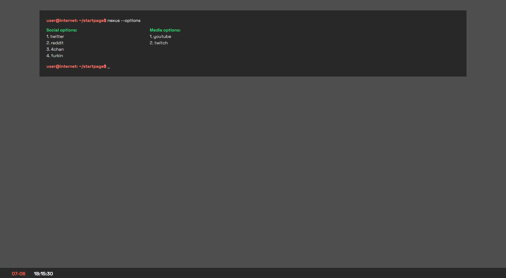

# Public Startpage Demo

the project originally only held 1 startpage, which is now located in the zt_original folder, 
since i made that a few years ago and i've gotten a lot more comfortable with WebDev i've decided to expand
the project a bit, including more examples of potential start-pages, consider this a WebDesign portfolio

### What is a startpage?

a startpage is a "locally hosted" (usually just a .html file stored on the device and accessed by a filepath) 
html page that serves as the "homepage" for your browser, this is the page that
first opens when you launch your browser, and could be the default page for new tabs in your browser of choice
with that said the ability to utilize startpages differs from browser to browser. in general the consensus seems to be
that browsers like firefox offers more flexibility in terms of customization for these things then for instance chrome. 
but with a plethora of browsers and extensions for each of them these startpages are usefull no matter what you choose
to work with as your browser of choice.

### what is in the project?

* `zt_original`:
this was the first project, it uses bootstrap and VanillaJS to display a collection of links in 4 different menus. simple but efficient, and easily customizable imo 

* `nexus`:
this is a simple project set up with vanilla JS and tailwind, it has a minimal display, impersonating a terminal.
the links are organized into categories in the linkConfig.js file, so that they can be easily changed. the startpage 
allows you to either interact with links directly by clicking, or through a more text-based approach, 
where you type the name of the page you wish to visit and press enter. if that page is in the config your 
browser opens a new window for you. the startpage also supports autocomplete and cycling using the tabkey, 
so you could type the first few characters of a site, then press tab to cycle through all pages starting with that 
character, before pressing enter to launch a new tab in your browser

* `Z3R0`:
Zero introduces the usage of the geo-location api to provide a clean interface that shows user-specific
data as part of the system status line. including current location and weather, using 3rd party FOS API's
that provide weather-information and reverse geocoding services.

* `_fokus`;
Fokus is a NextJS built startpage that supports a localstorage markdown based note-editor,
to create a static version of the site the build has been configured to export generated pages
to the location `./fokus/out/index.html`, in order to generate these pages you need Node and NPM,
you can then run the following commands.

1. `npm i` → installs all the dependecies
2. `npm run build` → generates the output
